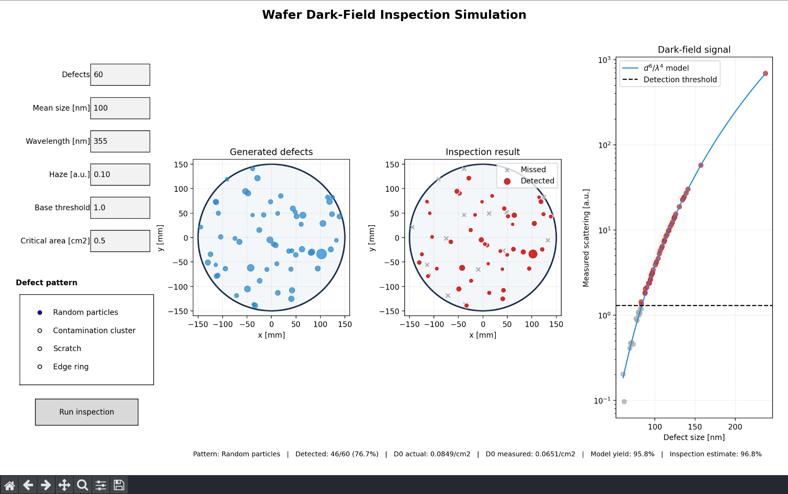

# Wafer Inspection Simulator

Python-based educational simulation of semiconductor wafer defect inspection, optical detection, and defect-limited yield.



## Overview

This project was developed as part of an Introduction to VLSI course project on semiconductor wafer quality assurance.

The simulator models wafer defects, optical inspection, and the effect of defect density on manufacturing yield.

## Features

- Simulates multiple wafer defect patterns:
  - Random particles
  - Contamination clusters
  - Scratches
  - Edge-ring defects
- Models dark-field optical inspection
- Uses Rayleigh scattering behavior proportional to d^6 / lambda^4
- Applies a configurable detection threshold
- Calculates actual and detected defect density
- Estimates defect-limited yield using a Negative-Binomial model
- Provides interactive controls for simulation parameters
- Visualizes generated defects, detected/missed defects, and optical scattering signal

## Technologies

- Python
- NumPy
- Matplotlib

## How to Run

1. Make sure Python 3 is installed.

2. Install the required packages:

```bash
pip install numpy matplotlib
```

3. Run the simulator:

```bash
python wafer_qa_simulator.py
